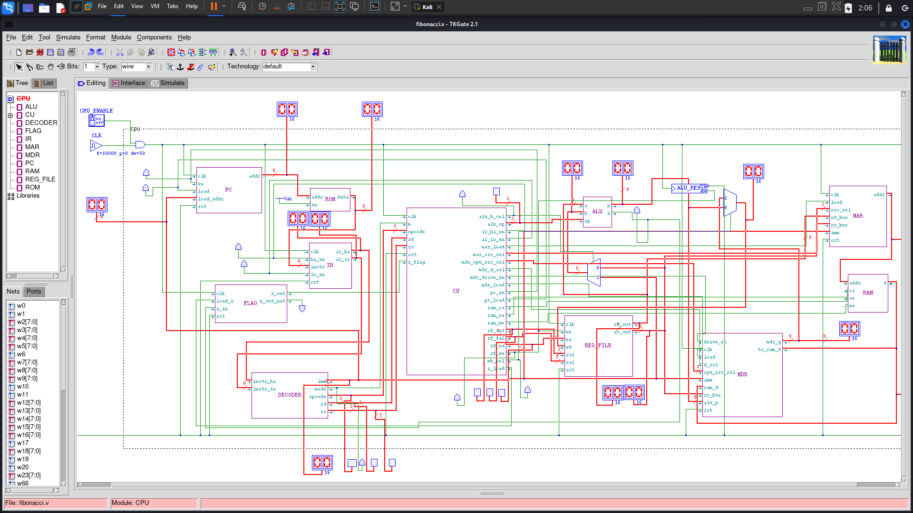

# 8-bit CPU Simulation in TkGate

A minimal 8-bit CPU designed and simulated in **TkGate**, featuring a **custom ISA** and a sample program that computes the **Fibonacci sequence**.  
While the included program demonstrates Fibonacci generation, the CPU can execute any program written using the provided instruction set.

## Files

- `ISA.pdf` — specification of the custom instruction set architecture
- `program.mem` — machine code in hex format for the Fibonacci program
- `io.mem` — RAM contents used for input and output during simulation

## Running the Simulation

The input `n` must be written at memory address `0xF0` inside `io.mem`.

Example:
```text
f0/ 07
````

This runs the Fibonacci program for `n = 7`.

The output sequence is written starting at memory address `0xA0`.

After execution:

1. Open the **Simulation** tab in TkGate
2. Open the **RAM** module
3. Click **Display Memory**
4. Check memory starting from `0xA0`

Expected output for `n = 7`:

```text
a0/ 00 01 01 02 03 05 08
```

A final `0x00` may appear after the sequence due to temporary storage being dumped at the end of execution.

## Design Screenshot


## Notes

This project was built to demonstrate:

* custom ISA design
* basic CPU datapath and control logic
* memory-mapped input/output
* program execution in hardware simulation
